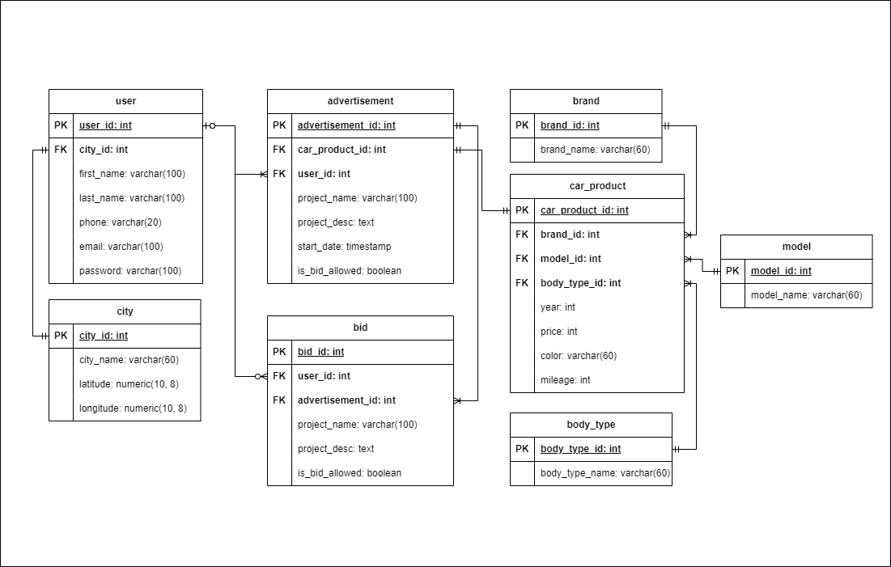

# Used Car Online Marketplace Database
PostgreSQL Database design and implementation for Used Car Online Marketplace.

## Mission Statement
A stakeholder is interested in developing an Online Marketplace that would enable individuals to advertise their cars for sale while allowing potential buyers to search and filter listings based on common features like brand, model, year, etc. Users should also be able to bid on prices if the seller permits this feature. 

As a database designer, your task is to create a relational database that can efficiently store and manage the seller, car, buyer, and related data.

## Feature Constraint
For more details, here are the features and limitations of this project:
1. Each application user can offer more than one used car product.
2. Before selling a car product, the user must first complete his personal data, such as name, contact, and location domicile.
3. Users offer their products through advertisements that will be displayed on the website.
4. This ad contains a title, detailed product information offered, and seller contact.
5. Some of the information that must be written in the ad is as follows
    - car brand: Toyota, Daihatsu, Honda, etc
    - Model: Toyota Camry, Toyota Corolla Altis, Toyota Vios,Toyota Camry Hybrid, etc
    - Car body type: MPV, SUV, Van, Sedan, Hatchback, etc
    - Car type: manual or automatic
    - Car manufacture year: 2005, 2010, 2011, 2020
    Other descriptions, such as color, distance traveled, etc., may be added as needed.
6. Each user can search for the cars offered based on the location of the seller user, the car brand, and the type of car body.
7. If a potential buyer is interested in a car, he can bid on the price of the product if the seller allows the bidding feature.
8. Purchase transactions are made outside the application so they are not within the scope of the project

## Table Structures

In order to design our database, first let's determine what tables are required in this database.

| Table Name | Description | 
| --- | --- | 
| user | Store general information of the user |
| city | Store more detailed information of user's city address |
| advertisement | Store information about product that user want to sell |
| bid | Store information about user who bid on certain advertisement |
| car_product | Store detailed information about car that user want to sell |
| brand | Store information about product's brand name |
| model | Store information about product's model name |
| body_type | Store information about product's body tipe name |

## ER Diagram

After deciding required tables, we can create ER diagram that contain all of those table, relationship between them, field for each table, and primary-foreign key that are needed for this database.

## Establishing Business Rule

1. Table: user

    Business Rule:
    - All field can't be null

2. Table: city

    Business Rule:
    - All field can't be null

3. Table: advertisement

    Business Rule:
    - Desc field can be null
    - The relationship between user are mandatory to optional as there are user is only looking or buying and don't put ads.  When user delete their account, respective field on this table are set to null
    - The relationship between car_product are mandatory to mandatory as product only exist becase its shown on the ads.  The data on the product can be deleted and the respective advertisement will be deleted as well

4. Table: bid

    Business Rule:
    - All field can't be null
    - The relationship between user are mandatory to optional as there are user who don't bid.  When user delete their account, respective field on this table are set to null
    - The relationship between advertisement are optional to mandatory as there is ads that don't allow bid.  When an advertisement is deleted, respective data on this table will be deleted as well

5. Table: car_product

    Business Rule:
    - Color, and mileage can be null
    - The relationship between brand, model, and body type are mandatory to mandatory, and the data in those table can be deleted only if there are no related data in the car_product table
    - Price must be > 0
    - Year must be > 1900

6. Table: brand
    Business Rule:
    - All field can't be null

7. Table: model
    Business Rule:
    - All field can't be null

8. Table: body_type
    Business Rule:
    - All field can't be null