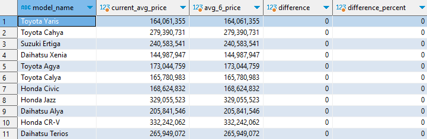

# Used Car Online Marketplace Database
PostgreSQL Database design and implementation for Used Car Online Marketplace.

## Mission Statement
A stakeholder is interested in developing an Online Marketplace that would enable individuals to advertise their cars for sale while allowing potential buyers to search and filter listings based on common features like brand, model, year, etc. Users should also be able to bid on prices if the seller permits this feature. 

As a database designer, your task is to create a relational database that can efficiently store and manage the seller, car, buyer, and related data.

## Feature Constraint
For more details, here are the features and limitations of this project:
1. Each application user can offer more than one used car product.
2. Before selling a car product, the user must first complete his personal data, such as name, contact, and location domicile.
3. Users offer their products through advertisements that will be displayed on the website.
4. This ad contains a title, detailed product information offered, and seller contact.
5. Some of the information that must be written in the ad is as follows
    - Car brand: Toyota, Daihatsu, Honda, etc
    - Model: Toyota Camry, Toyota Corolla Altis, Toyota Vios,Toyota Camry Hybrid, etc
    - Car body type: MPV, SUV, Van, Sedan, Hatchback, etc
    - Car type: manual or automatic
    - Car manufacture year: 2005, 2010, 2011, 2020
    Other descriptions, such as color, distance traveled, etc., may be added as needed.
6. Each user can search for the cars offered based on the location of the seller user, the car brand, and the type of car body.
7. If a potential buyer is interested in a car, he can bid on the price of the product if the seller allows the bidding feature.
8. Purchase transactions are made outside the application so they are not within the scope of the project

## Table Structures

In order to design our database, first let's determine what tables are required in this database.


| Table Name | Description | 
| --- | --- | 
| user | Store general information of the user |
| city | Store more detailed information of user's city address |
| advertisement | Store information about product that user want to sell |
| bid | Store information about user who bid on certain advertisement |
| car_product | Store detailed information about car that user want to sell |
| brand | Store information about product's brand name |
| model | Store information about product's model name |
| body_type | Store information about product's body tipe name |

## ER Diagram

After deciding required tables, we can create ER diagram that contain all of those table, relationship between them, field for each table, and primary-foreign key that are needed for this database.


## Establishing Business Rule

1. Table: user

    Business Rule:
    - All field can't be null
    - The relationship between city are mandatory to mandatory as user required to fill their data domicile included, and the data in city table can be deleted only if there are no related data in the user table

2. Table: city

    Business Rule:
    - All field can't be null

3. Table: advertisement

    Business Rule:
    - Desc and updated_at field can be null
    - The relationship between user are mandatory to optional as there are user is only looking or buying and don't put ads.  When user delete their account, respective field on this table are set to null (meaning the ads will still exist)
    - The relationship between car_product are mandatory to mandatory as product only exist becase its shown on the ads.  The data on the product can be deleted and the respective advertisement will be deleted as well

4. Table: bid

    Business Rule:
    - All field can't be null
    - Bid status value mus be in: Sent or Cancelled
    - The relationship between user are mandatory to optional as there are user who don't bid.  The data on the USER can be deleted and the respective BID will be deleted as well
    - The relationship between advertisement are optional to mandatory as there is ads that don't allow bid.  When an advertisement is deleted, respective data on this table will be deleted as well

5. Table: car_product

    Business Rule:
    - Color, and mileage can be null
    - Price must be > 0
    - Year must be > 1900
    - The relationship between brand, model, and body type are mandatory to mandatory, and the data in those table can be deleted only if there are no related data in the car_product table

6. Table: brand

    Business Rule:
    - All field can't be null

7. Table: model

    Business Rule:
    - All field can't be null

8. Table: body_type

    Business Rule:
    - All field can't be null

## Transactional Query Example

1. Find car with release date of 2015 and above

    ```
    SELECT 
        car_product_id,
        brand_name,
        model_name,
        year,
        price
    FROM car_product as cp
    JOIN brand as b
        ON b.brand_id = cp.brand_id
    JOIN model as m
        ON m.model_id = cp.model_id
    WHERE
        year >= 2015
    ```

    Output:

    

2. Input new bid record

    ```
    # In case the query didn't immediately work because the table have been inserted with dummy data previously
    SELECT setval(pg_get_serial_sequence('bid', 'bid_id'), coalesce(max(bid_id),0)+1, false) FROM bid;


    INSERT INTO bid(user_id, advertisement_id , bid_date, bid_price, bid_status)
    VALUES(96, 69, '2023-04-10 17:09:05.000', 230000000, 'Sent');
    ```

    Output:

    Before:

    

    After:

    

3. See cars that are sold by Opung Sihotang by newest date

    ```
    SELECT 
        cp.car_product_id,
        brand_name,
        model_name,
        year,
        price,
        created_at,
        concat(first_name, ' ', last_name) AS seller_name 
    FROM advertisement a  
    JOIN car_product cp 
        ON a.car_product_id = cp.car_product_id 
    JOIN "user" u 
        ON a.user_id = u.user_id 
    JOIN brand b 
        ON b.brand_id = cp.brand_id 
    JOIN model m 
        ON m.model_id = cp.model_id 
    WHERE first_name = 'Opung' AND last_name = 'Sihotang'
    ORDER BY created_at DESC
    ```

    Output:

    

4. See cars with 'Yaris' model sort by cheapest

    ```
    SELECT 
        cp.car_product_id,
        brand_name,
        model_name,
        year,
        price
    FROM advertisement a 
    JOIN car_product cp 
        ON cp.car_product_id = a.car_product_id 
    JOIN brand b 
        ON b.brand_id  = cp.brand_id 
    JOIN model m 
        ON m.model_id  = cp.model_id
    WHERE model_name = 'Toyota Yaris'
    ORDER BY price ASC;
    ```

    Output:

    

5. Looking for the nearest used car based on a city id 3173, the shortest distance is calculated based on latitude longitude. Distance calculations can be calculated using the euclidean distance formula based on latitude and longitude.
    
    ```
    -- Create euclidean distance fun
    CREATE OR REPLACE FUNCTION euclidean_distance(lat1 double precision, lon1 double precision, lat2 double precision, lon2 double precision)
    RETURNS double precision
    AS $$
    BEGIN
    RETURN sqrt((lat1 - lat2) ^ 2 + (lon1 - lon2) ^ 2);
    END;
    $$ LANGUAGE plpgsql;

    -- Where city id 3171(-6.186486, 106.834091)
    SELECT 
        cp.car_product_id,
        brand_name,
        model_name,
        year,
        price,
        city_name,
        euclidean_distance(c.latitude, c.longitude, -6.186486, 106.834091) as distance
    FROM advertisement a 
    JOIN car_product cp 
        ON cp.car_product_id = a.car_product_id 
    JOIN brand b 
        ON b.brand_id  = cp.brand_id 
    JOIN model m 
        ON m.model_id  = cp.model_id
    JOIN "user" u 
        ON u.user_id = a.user_id 
    JOIN city c 
        ON c.city_id = u.city_id
    WHERE euclidean_distance(c.latitude, c.longitude, -6.186486, 106.834091) = 0;
    ```

    Output:

    

## Analitical Query Example

1. Car model popularity rank based on the count number of bid

    ```
    SELECT 
        model_name,
        count(*) AS product_count,
        count(bid_id) AS count_bid
    FROM 
        advertisement a  
    LEFT JOIN bid b 
        ON a.advertisement_id = b.advertisement_id 
    JOIN car_product cp 
        ON a.car_product_id  = cp.car_product_id 
    JOIN model m 
        ON cp.model_id = m.model_id 
    GROUP BY model_name
    ORDER BY count_bid desc
    ```

    Output:

    

2. Compare average price of car brand and model by city
    ```
    SELECT 
        city_name,
        brand_name,
        model_name,
        AVG(price) AS avg_car_city 
    FROM 
        advertisement a 
    JOIN "user" u 
        ON a.user_id = u.user_id 
    JOIN city c 
        ON u.city_id = c.city_id 
    JOIN car_product cp 
        ON cp.car_product_id = a.car_product_id 
    JOIN model m 
        ON m.model_id = cp.model_id 
    JOIN brand b 
        ON b.brand_id = cp.brand_id
    GROUP BY city_name, brand_name, model_name;
    ```

    Output:

    

3. From advertisement of a car, compare bid_date bid_price and the next bid date and price of users

    ```
    WITH next_bid AS (
        SELECT 
            user_id,
            bid_date,
            bid_price,
            LEAD(bid_date) OVER (PARTITION BY user_id ORDER BY bid_date) AS next_bid_date,
            LEAD(bid_price) OVER (PARTITION BY user_id ORDER BY bid_date) AS next_bid_price
        FROM bid
    )
    SELECT 
        model_name,
        u.user_id,
        b.bid_date,
        b.bid_price,
        next_bid.next_bid_date AS next_bid_date,
        next_bid.next_bid_price AS next_bid_price
    FROM 
        advertisement a 
    JOIN "user" u 
        ON a.user_id = u.user_id 
    JOIN bid b 
        ON a.advertisement_id = b.advertisement_id 
    JOIN car_product cp 
        ON cp.car_product_id = a.car_product_id 
    JOIN model m 
        ON m.model_id = cp.model_id 
    LEFT JOIN next_bid 
        ON b.user_id = next_bid.user_id 
        AND b.bid_date = next_bid.bid_date 
        AND b.bid_price = next_bid.bid_price;
    ```

    In this query, the CTE named next_bid calculates the next bid date and bid price for each user using the LEAD() window function. The LEAD() function retrieves the next row's value based on a specified order, and the OVER() clause partitions the data by user ID and orders it by bid date.

    Output:

    

4. Comparing the percentage difference in the average car price by model and the average bid price offered by customers in the last 6 days 
    - Difference is the difference between the average price of a car model (avg_price) and the average bid price offered for that model (avg_bid_6days)
    - The difference can be negative or positive
    - Difference_percent is the percentage of the difference that has been calculated, namely by means of the difference divided by the average price of the car model (avg_price) multiplied by 100%
    - Difference_percent can be negative or positive
    In the question stated for months but my generated data dont have span of months, so I used days.

    ```
    -- CTE 6 days
    WITH avg_6_days AS (
        SELECT 
            model_name,
            ROUND(AVG(price)) AS avg_6_price
        FROM 
            advertisement a 
        JOIN "user" u 
            ON a.user_id = u.user_id 
        JOIN bid b 
            ON a.advertisement_id = b.advertisement_id 
        JOIN car_product cp 
            ON cp.car_product_id = a.car_product_id 
        JOIN model m 
            ON m.model_id = cp.model_id
        WHERE 
            b.bid_date >= DATE_TRUNC('days', CURRENT_DATE - INTERVAL '6 days')
        GROUP BY 
            model_name
    ),
    -- CTE overall avg
    current_avg AS (
        SELECT 
            model_name,
            ROUND(AVG(price)) AS current_avg_price
        FROM 
            advertisement a 
        JOIN "user" u 
            ON a.user_id = u.user_id 
        JOIN bid b 
            ON a.advertisement_id = b.advertisement_id 
        JOIN car_product cp 
            ON cp.car_product_id = a.car_product_id 
        JOIN model m 
            ON m.model_id = cp.model_id
        GROUP BY 
            model_name
    )
    SELECT 
        c.model_name,
        c.current_avg_price,
        COALESCE(a.avg_6_price, 0) AS avg_6_price,
        c.current_avg_price - COALESCE(a.avg_6_price, 0) AS difference,
        CASE 
            WHEN COALESCE(a.avg_6_price, 0) = 0 THEN 0 
            ELSE (c.current_avg_price - COALESCE(a.avg_6_price, 0)) / COALESCE(a.avg_6_price, 0) * 100
        END AS difference_percent
    FROM 
        current_avg c 
    LEFT JOIN 
        avg_6_days a 
        ON c.model_name = a.model_name;
    ```

    Output:

    

5. Create a window function of the average bid price of a car brand and model for the last 6 days.  In the question stated for months but my generated data dont have span of months, so I used days.

    ```
    SELECT 
        model_name,
        COALESCE(ROUND(AVG(CASE WHEN rank = 1 THEN price END)), 0) AS d_min_1,
        COALESCE(ROUND(AVG(CASE WHEN rank = 2 THEN price END)), 0) AS d_min_2,
        COALESCE(ROUND(AVG(CASE WHEN rank = 3 THEN price END)), 0) AS d_min_3,
        COALESCE(ROUND(AVG(CASE WHEN rank = 4 THEN price END)), 0) AS d_min_4,
        COALESCE(ROUND(AVG(CASE WHEN rank = 5 THEN price END)), 0) AS d_min_5,
        COALESCE(ROUND(AVG(CASE WHEN rank = 6 THEN price END)), 0) AS d_min_6
    FROM (
        SELECT 
            model_name,
            price,
            RANK() OVER (
                PARTITION BY model_name
                ORDER BY date_trunc('day', bid_date) DESC
            ) AS rank
        FROM 
            advertisement a 
        JOIN "user" u 
            ON a.user_id = u.user_id 
        JOIN bid b 
            ON a.advertisement_id = b.advertisement_id 
        JOIN car_product cp 
            ON cp.car_product_id = a.car_product_id 
        JOIN model m 
            ON m.model_id = cp.model_id
        WHERE 
            bid_date >= DATE_TRUNC('day', CURRENT_DATE - INTERVAL '6 months')
        GROUP BY 
            model_name, 
            date_trunc('day', bid_date), 
            price
    ) t
    GROUP BY 
        model_name;
    ```

    Output:

    